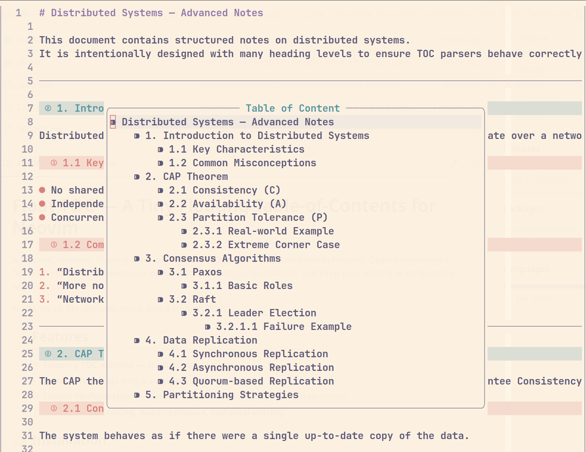

# float-toc.nvim


_Lightweight floating TOC for Markdown — clean, simple, distraction-free._


A tiny, modern floating Table-of-Contents viewer for Markdown in Neovim.
Pop open a minimal floating window, jump across headings instantly, and keep your writing workflow clean.

---

## ✨ Features

- 🪶 **Floating TOC window** — stays out of your way
- 🧭 **Jump to headings** instantly
- ⚙️ **Configurable** — choose icon, indentation, window ratio
- 📝 **Perfect for note-taking, documentation, or writing**

---

## 📦 Installation

Example using **lazy.nvim**:

```lua
{
    "lum1nar/float-toc",
    opts = {
    -- your options here
    }
}
```

---

## ⚙️ Setup

```lua
require("float-toc").setup({
    bullet_icon = "⁍",   -- icon before each heading
    -- bullet_icon options: { "•", "·", "●", "▪", "▎", "▏", "▍", "╎", "▶", "›", "▸", "◆", "◇", "◦", "✦" }
    indent_width = 4,      -- indentation per level
    width_ratio = 0.4,     -- window width relative to editor
    height_ratio = 0.6,    -- window height relative to editor
})
```

Optional keymap:

```lua
vim.keymap.set("n", "<leader>t", "<cmd>FloatTOC<cr>")
```

All settings are optional — the defaults work out of the box.

---

## 🚀 Usage

Open the floating TOC:

```vim
:FloatTOC
```
